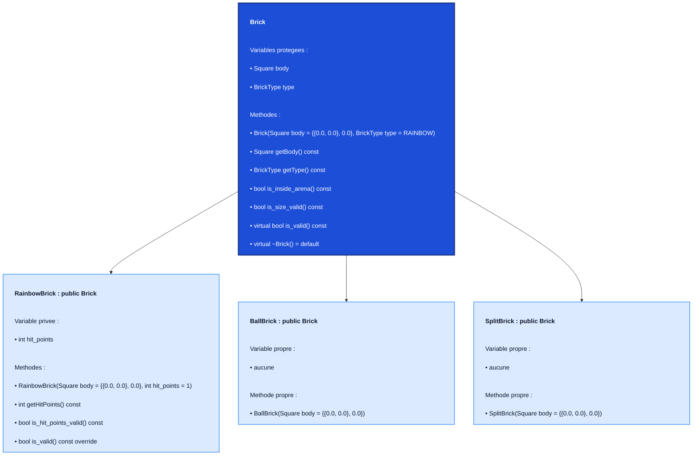

# Arbre des classes `Brick`

Ce document montre uniquement :
- la super-classe `Brick`
- ses variables et ses méthodes
- les sous-classes qui héritent de `Brick`
- leurs variables et leurs méthodes propres

---

## Arbre visuel

---

## Version simple

- `Brick`
  - Variables protegees
    - `Square body`
    - `BrickType type`
  - Methodes
    - `Brick(Square body = {{0.0, 0.0}, 0.0}, BrickType type = RAINBOW)`
    - `Square getBody() const`
    - `BrickType getType() const`
    - `bool is_inside_arena() const`
    - `bool is_size_valid() const`
    - `virtual bool is_valid() const`
    - `virtual ~Brick() = default`
  - Sous-classes
    - `RainbowBrick : public Brick`
      - Variable privee
        - `int hit_points`
      - Methodes
        - `RainbowBrick(Square body = {{0.0, 0.0}, 0.0}, int hit_points = 1)`
        - `int getHitPoints() const`
        - `bool is_hit_points_valid() const`
        - `bool is_valid() const override`
    - `BallBrick : public Brick`
      - Variable propre
        - `aucune`
      - Methode propre
        - `BallBrick(Square body = {{0.0, 0.0}, 0.0})`
    - `SplitBrick : public Brick`
      - Variable propre
        - `aucune`
      - Methode propre
        - `SplitBrick(Square body = {{0.0, 0.0}, 0.0})`

---

## Affichage dans VS Code

- ouvrir [brick_class_dependencies.md](/Users/liamvancamp/Desktop/EPFL/BA2/ICC_2/ICC_2_proj/PROJET_BRICK_BREAKER/Structuration_arbreOrganisation/brick_class_dependencies.md)
- `Cmd + Shift + V` pour voir l'arbre visuel
- le texte dans les cases est maintenant aligne a gauche
- ou clic droit puis `Open Preview`

---

## Rappel rapide

- `Brick` est la super-classe.
- `RainbowBrick`, `BallBrick` et `SplitBrick` héritent de `Brick`.
- `RainbowBrick` ajoute `hit_points` et des méthodes de validation propres.
- `BallBrick` et `SplitBrick` n’ajoutent pas de variable, seulement leur constructeur.
