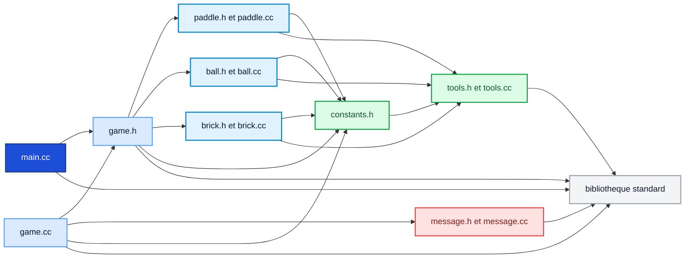
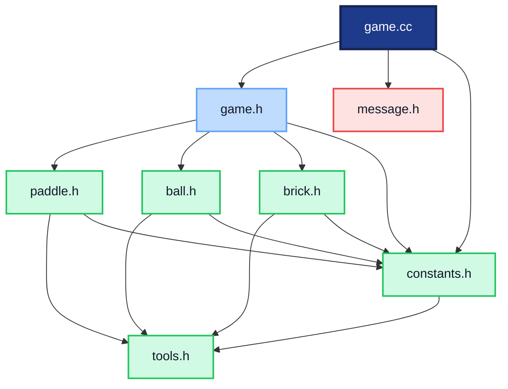

# Arbre de dépendance des fichiers

Ce document montre les dépendances entre les fichiers du projet à partir des `#include`.

---

## 1. Vue d'ensemble

---

## 2. Zoom sur game

---

## 3. Lecture simple

- `main.cc` lance le programme et inclut `game.h`.
- `game.cc` dépend de `game.h`, `message.h` et `constants.h`.
- `game.h` relie `paddle.h`, `ball.h` et `brick.h`.
- `paddle.h`, `ball.h` et `brick.h` utilisent `tools.h` et `constants.h`.
- `constants.h` dépend de `tools.h`.
- `message.cc` est séparé du modèle et sert aux messages d'erreur.

---

## 4. Affichage dans VS Code

- ouvrir ce fichier Markdown
- utiliser `Cmd + Shift + V`
- ou clic droit puis `Open Preview`
