# Structure de `game.cc`

Ce document est réécrit pour correspondre au `game.cc` actuel du projet.

Il décrit :
- les appels réellement présents dans `Game::load`
- les fonctions auxiliaires du namespace anonyme
- l’ordre exact des validations actuellement implémentées

---

## 1. Arbre réel des appels

```mermaid
flowchart TD

    A["1. Game::load(filename)"]

    A --> B["1.1 ouvrir std::ifstream file"]
    A --> C["1.2 read_score(file, score)"]
    A --> D["1.3 read_lives(file, lives)"]
    A --> E["1.4 read_paddle(file, paddle, px, py, pr)"]
    A --> F["1.5 read_bricks(file, bricks)"]
    A --> G["1.6 read_balls(file, balls)"]

    C --> C1["1.2.1 read_next_token"]
    C --> C2["1.2.2 stoi"]
    C --> C3["1.2.3 message::invalid_score si score < 0"]

    D --> D1["1.3.1 read_next_token"]
    D --> D2["1.3.2 stoi"]
    D --> D3["1.3.3 message::invalid_lives si lives < 0"]

    E --> E1["1.4.1 read_next_token x"]
    E --> E2["1.4.2 read_next_token y"]
    E --> E3["1.4.3 read_next_token r"]
    E --> E4["1.4.4 stod"]
    E --> E5["1.4.5 paddle = Paddle({x, y}, r)"]
    E --> E6["1.4.6 paddle.is_valid"]
    E --> E7["1.4.7 message::paddle_outside si invalide"]

    F --> F1["1.5.1 read_bricks_count"]
    F --> F2["1.5.2 boucle sur nb_bricks"]
    F2 --> F3["1.5.2.1 read_one_brick"]
    F3 --> F4["1.5.2.1.1 read_brick_type"]
    F3 --> F5["1.5.2.1.2 read_brick_geometry"]
    F3 --> F6["1.5.2.1.3 si type = RAINBOW"]
    F3 --> F7["1.5.2.1.4 si type = BALL"]
    F3 --> F8["1.5.2.1.5 sinon SPLIT"]

    F6 --> F61["1.5.2.1.3.1 create_rainbow_brick"]
    F61 --> F62["1.5.2.1.3.2 read_hit_points"]
    F61 --> F63["1.5.2.1.3.3 make_brick_body"]
    F61 --> F64["1.5.2.1.3.4 new RainbowBrick"]
    F61 --> F65["1.5.2.1.3.5 is_hit_points_valid"]
    F61 --> F66["1.5.2.1.3.6 validate_brick"]

    F7 --> F71["1.5.2.1.4.1 create_ball_brick"]
    F71 --> F72["1.5.2.1.4.2 make_brick_body"]
    F71 --> F73["1.5.2.1.4.3 new BallBrick"]
    F71 --> F74["1.5.2.1.4.4 validate_brick"]

    F8 --> F81["1.5.2.1.5.1 create_split_brick"]
    F81 --> F82["1.5.2.1.5.2 make_brick_body"]
    F81 --> F83["1.5.2.1.5.3 new SplitBrick"]
    F81 --> F84["1.5.2.1.5.4 validate_brick"]

    G --> G1["1.6.1 read_balls_count"]
    G --> G2["1.6.2 boucle sur nb_balls"]
    G2 --> G3["1.6.2.1 read_one_ball"]
    G3 --> G4["1.6.2.1.1 read_ball_geometry"]
    G3 --> G5["1.6.2.1.2 read_ball_delta"]
    G3 --> G6["1.6.2.1.3 Ball({{x, y}, r}, {dx, dy})"]
    G3 --> G7["1.6.2.1.4 validate_ball"]

    G7 --> G71["1.6.2.1.4.1 ball.is_inside_arena"]
    G7 --> G72["1.6.2.1.4.2 ball.is_delta_valid"]
    G7 --> G73["1.6.2.1.4.3 message::ball_outside"]
    G7 --> G74["1.6.2.1.4.4 message::invalid_delta"]

    classDef root fill:#1d4ed8,color:#ffffff,stroke:#1e3a8a,stroke-width:3px
    classDef main fill:#dbeafe,color:#0f172a,stroke:#60a5fa,stroke-width:2px
    classDef parse fill:#ede9fe,color:#0f172a,stroke:#8b5cf6,stroke-width:2px
    classDef build fill:#dcfce7,color:#0f172a,stroke:#22c55e,stroke-width:2px
    classDef validate fill:#fee2e2,color:#0f172a,stroke:#ef4444,stroke-width:2px

    class A root
    class B,C,D,E,F,G,F1,F2,F3,F6,F7,F8,G1,G2,G3 main
    class C1,C2,D1,D2,E1,E2,E3,E4,F4,F5,F62,G4,G5 parse
    class E5,F63,F64,F72,F73,F82,F83,G6 build
    class C3,D3,E6,E7,F65,F66,F74,F84,G7,G71,G72,G73,G74 validate
```

---

## 2. Ordre réel des validations

```mermaid
flowchart TD

    A["1. Validation réelle dans Game::load"]

    A --> B["1.1 Score"]
    B --> B1["1.1.1 lire token"]
    B --> B2["1.1.2 stoi"]
    B --> B3["1.1.3 tester score < 0"]
    B --> B4["1.1.4 sinon score valide"]

    A --> C["1.2 Lives"]
    C --> C1["1.2.1 lire token"]
    C --> C2["1.2.2 stoi"]
    C --> C3["1.2.3 tester lives < 0"]
    C --> C4["1.2.4 sinon lives valide"]

    A --> D["1.3 Paddle"]
    D --> D1["1.3.1 lire x y r"]
    D --> D2["1.3.2 construire Paddle"]
    D --> D3["1.3.3 tester paddle.is_valid"]
    D --> D4["1.3.4 sinon message::paddle_outside"]

    A --> E["1.4 Bricks"]
    E --> E1["1.4.1 lire nb_bricks"]
    E --> E2["1.4.2 tester nb_bricks >= 0"]
    E --> E3["1.4.3 pour chaque brick"]
    E3 --> E31["1.4.3.1 lire type"]
    E3 --> E32["1.4.3.2 tester type dans {0,1,2}"]
    E3 --> E33["1.4.3.3 lire x y c"]
    E3 --> E34["1.4.3.4 si RAINBOW lire hit_points"]
    E3 --> E35["1.4.3.5 si RAINBOW tester hit_points"]
    E3 --> E36["1.4.3.6 construire la brique"]
    E3 --> E37["1.4.3.7 tester is_inside_arena"]
    E3 --> E38["1.4.3.8 tester is_size_valid"]

    A --> F["1.5 Balls"]
    F --> F1["1.5.1 lire nb_balls"]
    F --> F2["1.5.2 tester nb_balls >= 0"]
    F --> F3["1.5.3 pour chaque ball"]
    F3 --> F31["1.5.3.1 lire x y r"]
    F3 --> F32["1.5.3.2 lire dx dy"]
    F3 --> F33["1.5.3.3 construire Ball"]
    F3 --> F34["1.5.3.4 tester is_inside_arena"]
    F3 --> F35["1.5.3.5 tester is_delta_valid"]

    A --> G["1.6 Fin actuelle"]
    G --> G1["1.6.1 aucun test de collision ici"]
    G --> G2["1.6.2 si tout passe retour true"]

    classDef root fill:#166534,color:#ffffff,stroke:#14532d,stroke-width:3px
    classDef section fill:#fef3c7,color:#0f172a,stroke:#f59e0b,stroke-width:2px
    classDef read fill:#dbeafe,color:#0f172a,stroke:#3b82f6,stroke-width:2px
    classDef validate fill:#fee2e2,color:#0f172a,stroke:#ef4444,stroke-width:2px
    classDef note fill:#e5e7eb,color:#0f172a,stroke:#6b7280,stroke-width:2px

    class A root
    class B,C,D,E,F,G section
    class B1,B2,C1,C2,D1,E1,E31,E33,E34,F1,F31,F32 read
    class B3,B4,C3,C4,D2,D3,D4,E2,E32,E35,E36,E37,E38,F2,F33,F34,F35 validate
    class G1,G2 note
```

---

## 3. Ce qui est spécifique à ton code actuel

- `read_next_token` ignore les lignes de commentaire qui commencent par `#`.
- Toutes les fonctions de lecture sont définies dans un `namespace` anonyme local à `game.cc`.
- `Game::load` lit dans cet ordre exact : `score`, `lives`, `paddle`, `bricks`, puis `balls`.
- Pour les briques, le code distingue bien trois cas : `RAINBOW`, `BALL` et `SPLIT`.
- Le cas `RAINBOW` est le seul qui lit un `hit_points`.
- La validation des briques est séparée dans `validate_brick`.
- La validation des balles est séparée dans `validate_ball`.
- Il n’y a pas encore de vérification de collisions dans `Game::load`.

---

## 4. Affichage dans VS Code

- ouvrir ce fichier Markdown
- utiliser `Cmd + Shift + V`
- ou clic droit `Open Preview`
