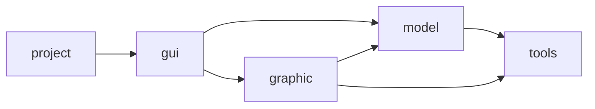

# Architecture des modules

Ce document decrit l'organisation prevue du projet autour de cinq modules:
`model`, `tools`, `gui`, `graphic` et `project`.

Objectif du rendu 2: integrer une interface graphique GTKmm tout en conservant
le modele independant.

---

## 1. Vue d'ensemble

Lecture simple:
- `project` lance l'application GTKmm.
- `gui` controle la fenetre, les actions de l'utilisateur et le rafraichissement.
- `graphic` lit `Game` et transforme le modele en elements dessinables.
- `model` contient les regles, l'etat du jeu, les collisions et la lecture de fichier.
- `tools` fournit les types et fonctions utilitaires partages.

---

## 2. Module model

Dossier: `sources/model`

Responsabilite:
- representer l'etat du Brick Breaker;
- charger et valider les donnees du jeu;
- gerer les collisions;
- gerer les entites principales: `Game`, `Ball`, `Paddle`, `Brick`;
- garder la logique du jeu independante de l'affichage;
- rester sans dependance GTKmm.

Le module `model` peut utiliser `tools`, mais ne devrait pas dependre de `gui` ni de `graphic`.
`Game` reste la source de verite de l'etat du jeu.

---

## 3. Module tools

Dossier: `sources/tools`

Responsabilite:
- definir les constantes globales du projet;
- fournir les structures geometriques simples comme `Point`, `Circle` et `Square`;
- centraliser les fonctions utilitaires comme les distances, normes et intersections.

Ce module doit rester petit et general. Il peut etre utilise par plusieurs autres modules sans connaitre leurs details.

---

## 4. Module gui

Dossier: `sources/gui`

Responsabilite prevue pour le rendu 2:
- gerer la fenetre GTKmm;
- contenir la drawing area;
- gerer les boutons;
- recevoir les evenements clavier;
- recevoir les evenements souris;
- declencher le rafraichissement de l'affichage;
- coordonner les appels vers `model` et `graphic`.

Le module `gui` sert donc de coordination entre la logique (`model`) et le rendu (`graphic`).
Il ne doit pas dupliquer l'etat de `Game`.

---

## 5. Module graphic

Dossier: `sources/graphic`

Responsabilite prevue pour le rendu 2:
- lire l'etat de `Game`;
- transformer le modele en objets dessinables;
- regrouper le code d'affichage;
- dessiner les balles, les briques, le paddle et les informations visibles.

Le module `graphic` ne doit pas contenir les regles du jeu. Il transforme un etat de jeu en affichage.
Il peut lire le modele, mais ne doit pas devenir une deuxieme representation de l'etat.

---

## 6. Module project

Dossier: `sources/project`

Responsabilite:
- contenir le point d'entree du programme;
- lancer l'application GTKmm;
- initialiser les modules necessaires;
- rester aussi simple que possible.

Actuellement, `main.cc` charge un fichier et instancie `Game`. Pour la suite, il pourra initialiser l'interface `gui` au lieu de piloter directement le modele.

---

## 7. Dependances souhaitees

Regle generale:
- les dependances doivent aller du programme principal vers l'interface, puis vers le modele et le rendu;
- `model` ne doit pas connaitre l'interface graphique;
- `model` ne doit pas dependre de GTKmm;
- `graphic` peut lire `Game`, mais ne doit pas porter les regles du jeu;
- `tools` reste le module commun et stable.

Dependances a eviter:
- `model` vers `gui`;
- `model` vers `graphic`;
- `tools` vers un module metier;
- logique de jeu directement dans `project/main.cc`.

---

## 8. Contraintes du rendu 2

- ne pas casser le rendu 1;
- garder `Game` comme source de verite;
- l'affichage lit le modele, mais ne le duplique pas;
- garder une separation claire entre `gui`, `graphic` et `model`;
- garder GTKmm hors de `model`.
